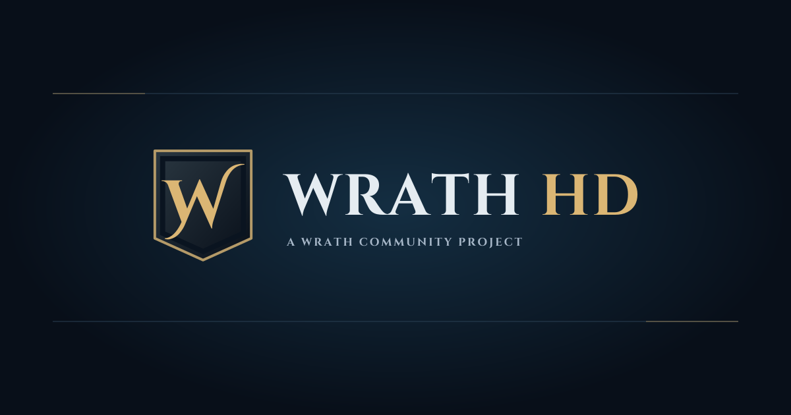
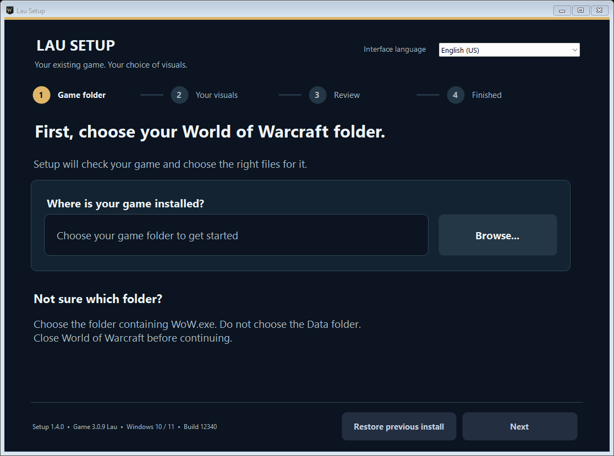

<!-- LANGUAGES:START -->
[English](../../../README.md) · [Deutsch](../de/README.md) · [Español (España)](../es-ES/README.md) · [Español (México)](../es-MX/README.md) · [Français](../fr/README.md) · [한국어](../ko/README.md) · [Русский](../ru/README.md) · [简体中文](../zh-CN/README.md) · [繁體中文](README.md) · [Português (Brasil)](../pt-BR/README.md)
<!-- LANGUAGES:END -->

<!-- HOTFIX-118-NOTICE -->
> **熱修復 1.1.8** — Setup 會檢查 Data 和目前語言資料夾中的 MPQ，識別已知的改名 Patch-Y，以及與目錄檔案完全相同的副本。發現可能的衝突、無法讀取或不支援的封存檔時，會停止安裝並顯示檔名，不會自動刪除該檔案。僅重新命名檔案不會改變內容雜湊。遊戲檔案仍為 3.0.8。
>
> 由於 Google 請求限制，完整翻譯尚未更新。下方原有正文描述的是較早版本的情況。請以最新英文原文為準。 [English](../../../README.md) · [1.1.8](https://github.com/CRSD-Lau/Lau-Setup/releases/tag/v1.1.8)

<!-- Author: Neil Mitchell; Creator: Neil Mitchell; Last Modified By: Neil Mitchell -->

> 自動翻譯。 [英文來源](../../../README.md)。若措詞不同，則以英文來源為準。

<p align="center">
  <a href="https://wrath-multilingual-hd.vercel.app/"></a>
</p>

<h1 align="center">Lau Setup</h1>
<p align="center"><strong>你的客戶。你的語言。你的Wrath。</strong><br />用於 Lau 視覺化升級的 Windows 和 Linux/Wine 安裝程式。</p>
<p align="center">
  <a href="https://github.com/CRSD-Lau/Lau-Setup/releases/latest">最新發布</a> ·
  <a href="https://wrath-multilingual-hd.vercel.app/">網站和畫廊</a> ·
  <a href="https://github.com/CRSD-Lau/Lau-Setup/issues/new/choose">報告問題</a> ·
  <a href="https://github.com/users/CRSD-Lau/projects/2">社區路線圖</a>
</p>

---

多语言拼写文本、宽屏加载图稿、自定义地面指示器和可选的高清地图，用于 **WoW 3.3.5a，构建 12340**。选择您现有的客户和视觉效果； Lau Setup下载所需的文件，验证它们，放置补丁并备份原始文件。

**安装程序 1.1.7 · 游戏发行 3.0.8 Lau · 九种客户端语言**

<a id="patch-s-stays-recoverable"></a>

## Patch-S 保持可恢復

**設定 1.1.7 修補程式：**重新啟用新拼字視覺效果重複使用符合的停用 Patch-S 並將普通停用副本移至 `LauSetupBackups`，因此資料不會保留活動/停用副本。在交易備份中保留不同的副本。關閉仍然使用`.mpq.disabled`。使用 **恢復先前的安裝** 進行恢復。

<a id="90-breath-and-slime-spray-warnings"></a>

## 90° 呼吸和黏液噴霧警告

**3.0.8 Lau：** 所有受支援的呼吸指示器和 Rotface Slime Spray 均為 **90° 總計**，經 Warmane 測試儀確認。涵蓋兩個領域的哈萊恩：薩維娜·怒火、薩薩裡奧、ICC Rimefang 和辛達苟薩。範圍和動畫時間被保留。經批准的較大哈利恩流星火半徑和淺藍色冷焰保持不變。

**已經安裝？ ** 先下載 **Setup 1.1.7**，選擇相同的資料夾和視覺效果，然後安裝。安裝程式檢查實際的 SHA-256 雜湊值：即使是具有相同大小和時間戳記的一位元組變更也會被偵測到。只有符合的新檔案才算已安裝。 `/pyversion` 報告 **3.0.8 Lau**。舊的安裝程式保留舊的嵌入式目錄。

[動畫色彩預覽與變更日誌](https://wrath-multilingual-hd.vercel.app/#changelog)

<a id="download"></a>

＃＃ 下載

| Windows | Linux / Wine |
| :--- | :--- |
| **[下載 LauSetup.exe](https://github.com/CRSD-Lau/Lau-Setup/releases/latest/download/LauSetup.exe)** | **[下載 LauSetup-Wine.zip](https://github.com/CRSD-Lau/Lau-Setup/releases/latest/download/LauSetup-Wine.zip)** |
| Windows 10 / 11 · .NET框架 4.8 | Wine 11.0 · Wine Mono 10.4.1 · 64-bit 前綴 |
| 關於 **156 知識庫** | 關於 **80 知識庫** · Python 3.9+ |
| [Windows 指導](START-HERE.md) | [Wine 指南和先決條件](wine/README.md) |

在安裝過程中下載遊戲檔案。英文核心安裝是關於 **472 MB** 的高清模型和新的拼字視覺效果，或 **259 MB** 的原始模型。可選地圖增加了更大的下載量；安裝程式會在安裝前顯示總數。

[SHA-256 校驗和](https://github.com/CRSD-Lau/Lau-Setup/releases/latest/download/SHA256SUMS.txt) · [發行說明](https://github.com/CRSD-Lau/Lau-Setup/releases/latest) · [驗證報告](https://github.com/CRSD-Lau/Lau-Setup/releases/latest/download/VALIDATION.json)

> **帶上您現有的客戶端。 ** 這是升級，而不是完整的遊戲用戶端、語言套件或高清模型庫。運行時安裝程式未捆綁。安裝程式使用者介面是英文的；遊戲內容支援九種語言環境。

<a id="one-setup-the-details-handled"></a>

## 一种设置。细节处理好了。

|選擇您的視覺效果 |控制您的安裝 |
| :--- | :--- |
|加強或普通奉獻|客戶端語言和模型檢測 |
|相容於高清客戶端的新咒語視覺效果僅下載所需的檔案 |
|可選的高清地圖和小地圖紋理| SHA-256 安裝前驗證 |
|區域寬螢幕載入圖稿|自動備份與可斷點下載 |
|本地化的法術名稱、排名和工具提示 |恢復和中斷操作恢復|

<p align="center"></p>

您的插件、SavedVariables、字體、登入插圖、領域設定和不相關的補丁保持不變。不包含個人使用者介面、憑證或分析。

<a id="get-started"></a>

## 開始吧

1。 **完全關閉 WoW。 ** 在 Wine 上，關閉所有前綴上的每個 WoW 實例。
2。 **啟動安裝程式並選擇您的客戶端資料夾。 ** Windows：開啟`LauSetup.exe`。 Linux：從 Wine ZIP 中提取所有四個檔案並使用下面的啟動器。
3。 **選擇您的視覺效果並安裝。 ** 增強奉獻開始選取；取消選取它以查看庫存外觀。新的法術視覺效果需要相容的高清模型基礎。地圖是可選的。
4。 **啟動 WoW 並運行 `/pyversion`。 ** 在進入遊戲之前確認已安裝的版本。

在 Linux 上，使用現有前綴從提取的資料夾中執行此命令：

```sh
WINEPREFIX="/absolute/path/to/your/existing/prefix" sh LauSetup.sh
```

作為普通用戶使用啟動器。它檢查 Linux 路徑、正在運行的遊戲、可用空間和跨前綴的安裝程式鎖定。使用本機Linux儲存；不支援連結資料夾、網路共用和 Windows 安裝的磁碟機。 [Wine 指南](wine/README.md) 列出了字體和所有先決條件。

在 Windows 上，如果缺少運行時，安裝程式會提供 Microsoft 的官方 .NET Framework 4.8 下載頁面。測試的 Wine 配置使用 **Wine Mono**，而不是 Windows .NET 安裝程式。

<a id="nine-client-languages"></a>

## 九種客戶端語言

英文 · 法文 · 德文 · 한국어 · Русский · 簡體中文 · 繁體中文 · 西班牙文 (España) · 西班牙文 (México)

`enUS` · `frFR` · `deDE` · `koKR` · `ruRU` · `zhCN` · `zhTW` · `esES` · `esMX`

設定遵循客戶端的活動區域設定。在更改配置之前安裝適當的語言檔案和字型。單獨更改配置值不會安裝語言包。

<a id="restore-with-your-backups"></a>

## 使用備份進行還原

關閉 WoW，透過同一啟動器重新開啟安裝程序，選擇同一客戶端並選擇 **恢復先前的安裝**。將 `LauSetupBackups` 保存在客戶端資料夾內：它包含原始記錄和復原記錄。

即使 `WoW.exe` 暫時遺失，也可以恢復中斷的安裝或恢復。如果另一個更新更改了已安裝的文件，則還原將停止並保留備份以供解決。一旦此安裝程式添加了地圖升級，它就會在版本更改期間保留它；恢復先前的安裝以撤消該升級。

<a id="tested-with-clear-limits"></a>

## 經過測試，有明確的限制

版本 1.1.7 通過了 Windows 和 Wine 上的 **50 回歸組**，包括每個平台的 108 語言環境/版本/地圖計畫。遊戲發表3.0.8先前在兩個平台均通過了六版升級和一位元組檢測；它的有效負載沒有改變。設定 1.1.7 還涵蓋了從所有標誌到新法術關閉序列，以及舊的禁用副本、重複切換和精確回滾。公共有效負載是匿名下載並經過哈希驗證的；測試了實際的核心安裝和回滾。

Wine 在本地 Linux 儲存上使用 **Wine 11.0 / Wine Mono 10.4.1** 提供了普通用戶的啟動器。 Halion 流星火幾何形狀與測試人員批准的 v2 完全匹配。 Coldflame、動畫軌道、原生火焰和法術表與 3.0.7 的位元組保持相同。網站動畫是說明性的模型。這些測試並不能證明每個 Linux 發行版或遊戲中的遭遇。

此版本不包含 Lutris、Proton 和 macOS 整合。 執行檔沒有數位簽章。

<a id="known-limitations-and-feature-requests"></a>

## 已知限制和功能請求

在建議功能之前，請閱讀[已知限制和假設](KNOWN-LIMITATIONS.md)：Warmane 伺服器控制、DLL/本機代碼範圍、受保護的 Lua 操作、指示器準確性和計時、DBC 依賴性以及平台/恢復限制。

<a id="for-contributors"></a>

## 對於貢獻者

- [建置、存檔放置與復原設計](docs/TECHNICAL.md)
- [貢獻與錯誤回報指導](CONTRIBUTING.md)
- [實施審查](REVIEW.md)
- [平台範圍及可行性](PLATFORM-FEASIBILITY.md)

遊戲有效負載透過 GitHub 版本進行分發。此儲存庫包含安裝程式來源、目錄、啟動器和文件；您不需要複製它來安裝升級。

<a id="built-on-community-work"></a>

## 以社區工作為基礎

**Andre** — Patch-Y 基線· **Loriendal & Trimitor** — 高清客戶端基礎· **Project Reforged 貢獻者** — 高清藝術作品· **Blizzard** — 原創遊戲、藝術作品與在地化文本 · **Lau** — 地面指標、相容性、適應性、測試和發布工具。

[完整製作人員](https://wrath-multilingual-hd.vercel.app/credits) · [螢幕截圖與安裝幫助](https://wrath-multilingual-hd.vercel.app/)

<sub>非官方社區項目。不隸屬於 Blizzard Entertainment，也不受其認可。原創遊戲和第三方藝術品仍然是其各自所有者的財產。</sub>

<a id="dbc-change-tracking"></a>

## DBC 變更跟踪

請參閱 [DBC 變更日誌](DBC-CHANGELOG.md) 以了解各個表格/記錄/欄位編輯和比較證據。 **3.0.7 → 3.0.8 沒有 DBC 編輯**：90° 指標更新更改的模型幾何形狀。設定 1.1.5–1.1.7 也保持 DBC 資料不變。
